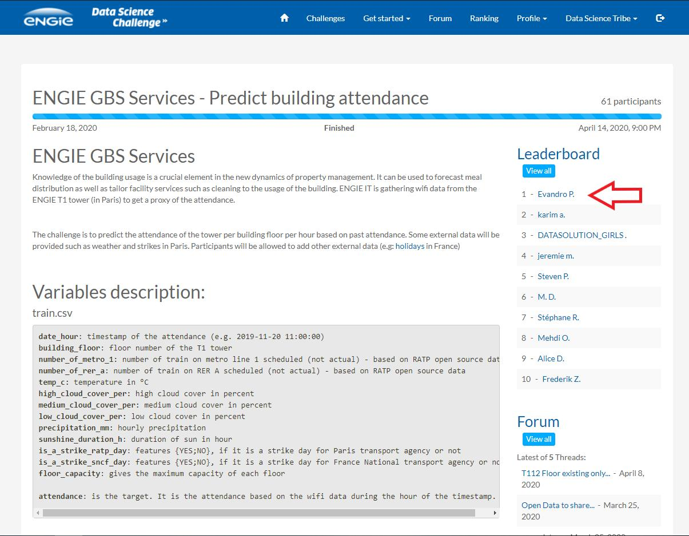

# Predicting Building Attendance with XGBoost

**Winner** solution for _challenge to predict a building attendance_ based on historical data.

## Developed

1. Data exploration
   1. Correlation analysis
   2. Feature analysis
   3. Plotting
2. Feature engineering
   1. Celaning
   2. Normalization
   3. New features
3. Train, Test and Evaluate different models
   1. Randon Forest
   2. Catboost
   3. XGBoost
4. Tunning parameter
   1. Grid parameter
   2. Cross Validation
5. Train model
   1. Training the model
6. Predict
   1. Predict futures attendances
7. Submit
   1. Submit to challenge

###### Libraries

* Pandas
* Matplotlib
* Sklearn
* XGBoost

#### Data Science Challenge ENGIE

###### Links
[XGBoost](https://xgboost.readthedocs.io/en/latest/#)